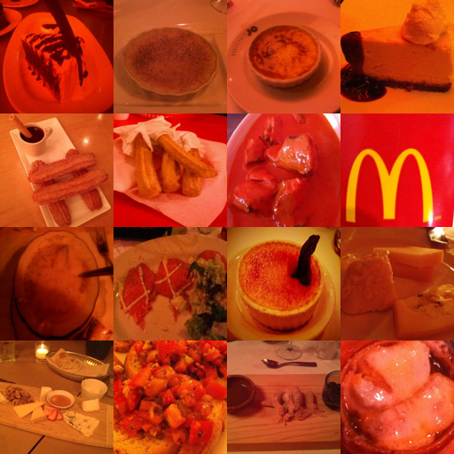
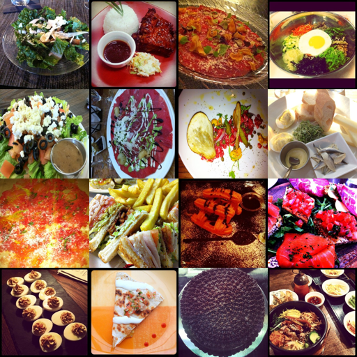
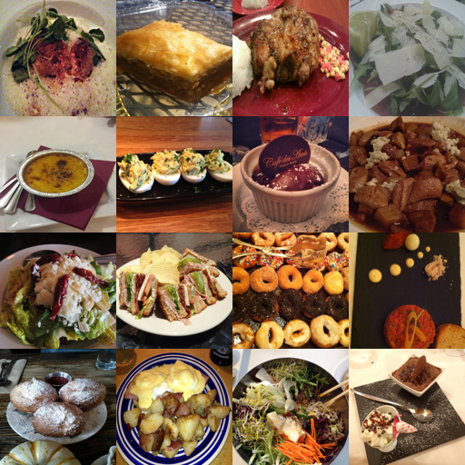
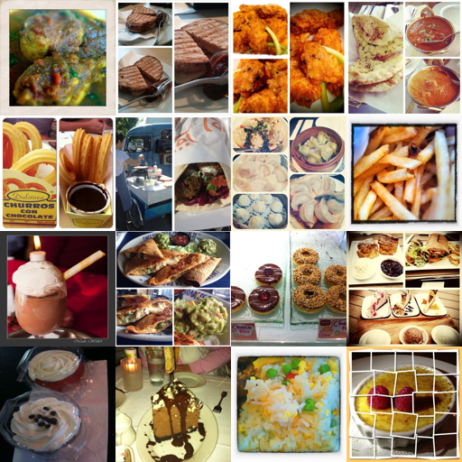
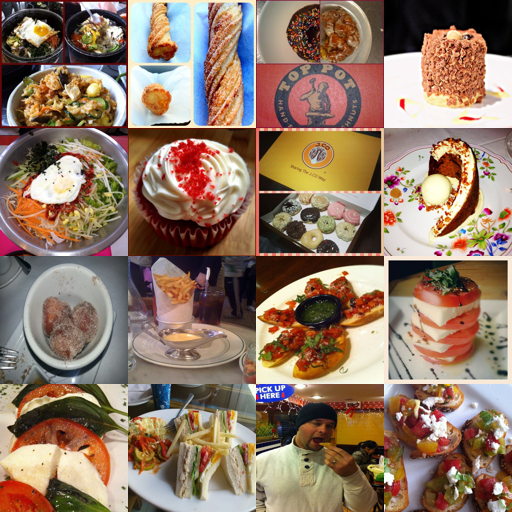
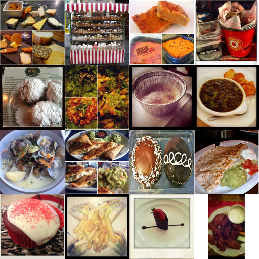
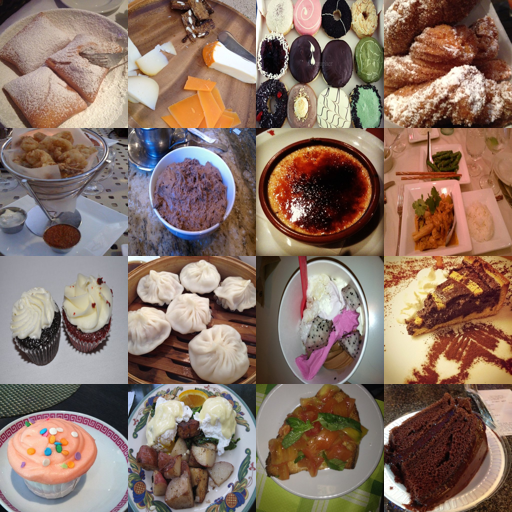
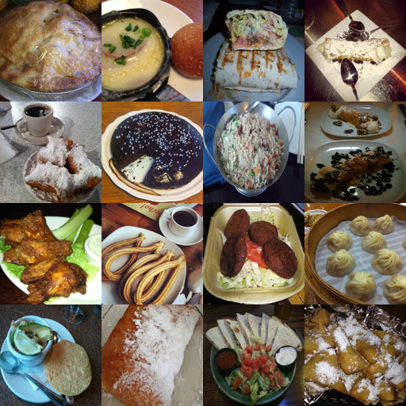
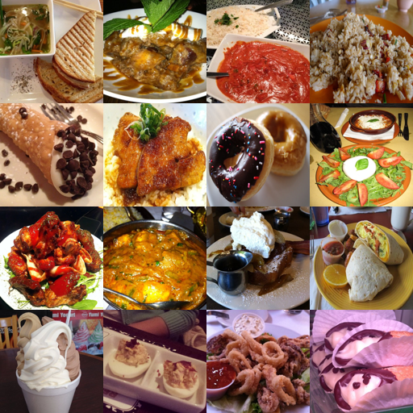

# SAE for CLIP — отчет

Дата: 2026-02-07

## 1. Что такое CLIP

CLIP — это мультимодальная модель, которая учит совместное пространство эмбеддингов для изображений и текстов и обучается контрастивной задачей (соответствие пар изображение–текст). В zero‑shot она классифицирует изображение через сравнение эмбеддинга изображения с эмбеддингами текстовых промптов классов.

## 2. Прошлые работы (реимплементируемые)

- LessWrong: _Towards Multimodal Interpretability: Learning Sparse Autoencoders for CLIP_ — обучение SAE на активациях CLIP и анализ признаков.
- LessWrong: _Interpreting and Steering Features in Images_ — SAE для управления генерацией Kandinsky 2.2.

## 3. Обучение SAE (Colab, Food101)

**Экстракция активаций**

- Модель: `open_clip` `ViT-B-32` (`openai`)
- Слой: `visual.transformer.resblocks.0`
- Данные: Food101 (train), подвыборка `num_samples=50000`
- Кеш: `artifacts/activation_cache/colab_food101_acts`

**Гиперпараметры обучения MSAE**

- `dict_size`: 8192
- `k_list`: [32, 64, 128, 256]
- `alpha_mode`: reverse
- `input_centering`: dataset
- `input_scaling`: dataset
- `epochs`: 10
- `batch_size`: 1024
- `lr`: 1e-3
- `l1_lambda`: 1e-4
- `device`: cuda (Colab)
- Чекпоинт: `artifacts/checkpoints/colab_msae`

**Метрики (последняя эпоха, MSAE)**

- `mse`: 0.154212
- `l1`: 0.053320
- `l0`: 256.00
- `r2`: 0.843875
- `evr_global`: 0.844952

## 4. Zero‑shot eval (CIFAR‑10 + STL‑10)

Таблица из `artifacts/eval/zeroshot_eval_table.md`:

| dataset | baseline_acc | sae_acc | acc_delta | dict_size |     l0 | evr_global |      mse |       l1 |
| ------- | -----------: | ------: | --------: | --------: | -----: | ---------: | -------: | -------: |
| cifar10 |       0.8511 |  0.8510 |   -0.0001 |      8192 | 256.00 |     0.8450 | 0.154212 | 0.053320 |
| stl10   |       0.9574 |  0.9574 |    0.0000 |      8192 | 256.00 |     0.8450 | 0.154212 | 0.053320 |

**Почему accuracy почти не деградирует**

- Модель MSAE обучена реконструировать активации выбранного слоя CLIP с высокой долей объясненной дисперсии (EVR ≈ 0.845), поэтому внесённое преобразование близко к идентичному.
- Разреженная проекция (Top‑K) сохраняет наиболее информативные компоненты, а декодер восстанавливает их обратно, минимизируя искажение эмбеддинга изображения.
- Вмешательство выполняется на том же слое, на котором SAE обучался, поэтому сдвиг распределения минимален и zero‑shot классификация почти не меняется.

## 5. Авто‑интерпретация (п.5)

**Коллажи и CSV**

- Коллажи для отчета (9 шт.): `report_assets/autointerp/latent_*.png`
- CSV для сдачи: `report_assets/autointerp.csv`
- Полные коллажи/манифест (локально): `artifacts/autointerp/`
- Количество латентов в CSV: 300, `top_k=16`

**Таблица auto‑interpretation**

Таблица из `artifacts/autointerp/autointerp_table.md`.

| latent_id |                   collage                    | interpretation                                                                                                                                             | status |
| --------: | :------------------------------------------: | ---------------------------------------------------------------------------------------------------------------------------------------------------------- | ------ |
|         0 |    | The images predominantly feature various food items presented in warm, reddish tones, creating a cozy and inviting atmosphere.                             | ok     |
|         2 |    | The common visual pattern across these images is a diverse array of colorful and creatively presented dishes, showcasing various cuisines and ingredients. | ok     |
|        58 |   | The images showcase a diverse array of plated dishes, highlighting various cuisines and presentation styles, with a focus on both savory and sweet items.  | ok     |
|       132 |  | The common visual pattern across these images is a diverse array of delicious food items, showcasing various cuisines and presentation styles.             | ok     |
|       136 |  | The common visual pattern across these images is a diverse array of food items, showcasing various cuisines, presentations, and textures.                  | ok     |
|       141 |  | The common visual pattern across these images is a diverse array of food items, showcasing various cuisines and presentation styles.                       | ok     |
|       157 |  | The images showcase a diverse array of desserts and sweet dishes, highlighting various textures, colors, and presentation styles.                          | ok     |
|       265 |  | The images showcase a diverse array of delicious dishes and desserts, highlighting various cuisines and culinary presentations.                            | ok     |
|       310 |  | The common visual pattern across these images is a diverse array of colorful and appetizing food dishes, showcasing various cuisines and desserts.         | ok     |

**Подборка латентов для отчета (3 типа + 3 любимых)**

**(i) Без специфических активаций на интерпретируемые паттерны**

- latent 136 — очень общий “food items”, без конкретного визуального паттерна.
- latent 141 — общий “food items / cuisines”, слабая специфичность.
- latent 310 — общий “food dishes / cuisines”, без чёткой формы.

**(ii) Специфические, но не обобщающие/не семантические**

- latent 0 — “warm, reddish tones”, скорее стилистический эффект.
- latent 58 — “plated dishes” и композиция, узкий визуальный паттерн.
- latent 157 — “desserts / sweet dishes”, более конкретный класс.

**(iii) Семантические, обобщающие на разные картинки**

- latent 2 — “diverse cuisines / ingredients”, семантика еды.
- latent 132 — “diverse food items / presentation”, обобщающий сигнал.
- latent 265 — “dishes and desserts”, широкая семантика.

**Любимые**

- latent 0 — выразимый стиль (цвет/тон).
- latent 157 — десерты и сладкие блюда.
- latent 2 — разнообразие кухонь и ингредиентов.

## 6. MSAE (Matryoshka Top‑K SAE)

**Что добавлено**

- Архитектура Matryoshka Top‑K SAE (MSAE) с несколькими уровнями разреженности.
- Нормировка входа (dataset mean/std) и EVR в нормированном пространстве.

**Полный прогон (Colab)**

- Чекпоинт: `artifacts/checkpoints/colab_msae`
- `dict_size`: 8192
- `k_list`: [32, 64, 128, 256]
- `evr_global`: 0.844952

**Пример команды**

```bash
PYTHONPATH=src python scripts/train_sae.py \
  --sae_type msae \
  --k_list 32,64,128,256 \
  --cache_dir artifacts/activation_cache/colab_food101_acts \
  --dict_size 8192 \
  --epochs 10 \
  --batch_size 1024 \
  --lr 1e-3 \
  --l1_lambda 1e-4 \
  --device cuda \
  --run_name colab_msae
```

## 7. Что осталось

- Экспорт SAE в HuggingFace Hub.
- Steering Kandinsky 2.2 + итоговые картинки (п.6).

## Команды запуска (локально)

```bash
# 1) Подготовка данных
make sample-images

# 2) Экстракт активаций
PYTHONPATH=src python scripts/extract_activations.py \
  --image_dir data/sample_images \
  --model ViT-B-32 \
  --pretrained openai \
  --layer visual.transformer.resblocks.0 \
  --num_samples 200 \
  --batch_size 16 \
  --shard_size 256 \
  --out_dir artifacts/activation_cache

# 3) Обучение SAE
PYTHONPATH=src python scripts/train_sae.py \
  --cache_dir artifacts/activation_cache/20260206_213525 \
  --dict_size 2048 \
  --epochs 10 \
  --batch_size 256 \
  --lr 1e-3 \
  --l1_lambda 1e-3 \
  --device cpu

# 4) Zero-shot eval
PYTHONPATH=src python scripts/eval_zeroshot.py \
  --dataset cifar10 --split test --batch_size 64 --num_workers 0

PYTHONPATH=src python scripts/eval_zeroshot.py \
  --dataset stl10 --split test --batch_size 64 --num_workers 0

# 5) Auto-interpretation (коллажи + CSV)
PYTHONPATH=src python scripts/build_collages.py \
  --cache_dir artifacts/activation_cache/20260206_213525 \
  --checkpoint artifacts/checkpoints/20260206_222126/last.pt \
  --num_latents 50 --top_k 16 --image_size 128 \
  --out_dir artifacts/autointerp/collages \
  --manifest_path artifacts/autointerp/collages_manifest.csv

PYTHONPATH=src python scripts/autointerp.py \
  --manifest_path artifacts/autointerp/collages_manifest.csv \
  --out_csv artifacts/autointerp/autointerp.csv

PYTHONPATH=src python scripts/make_p5_table.py \
  --autointerp_csv artifacts/autointerp/autointerp.csv \
  --out_path artifacts/autointerp/autointerp_table.md
```
